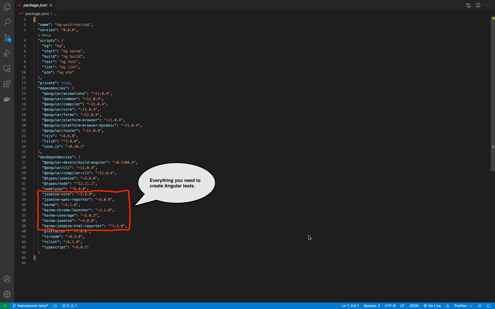
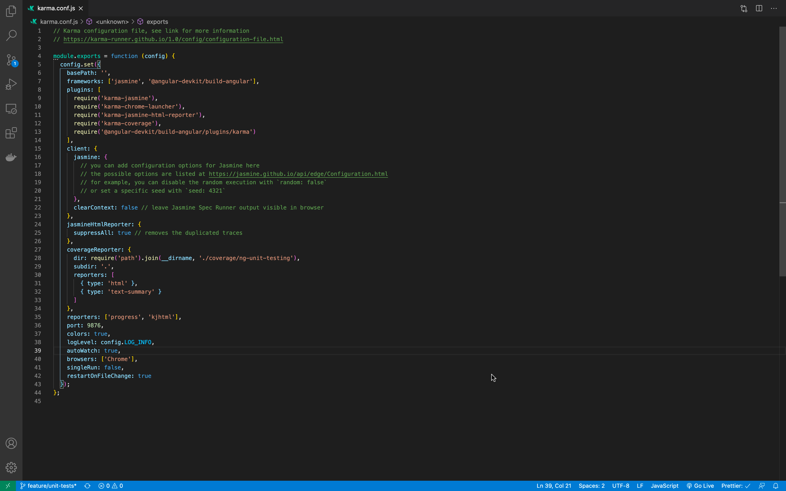
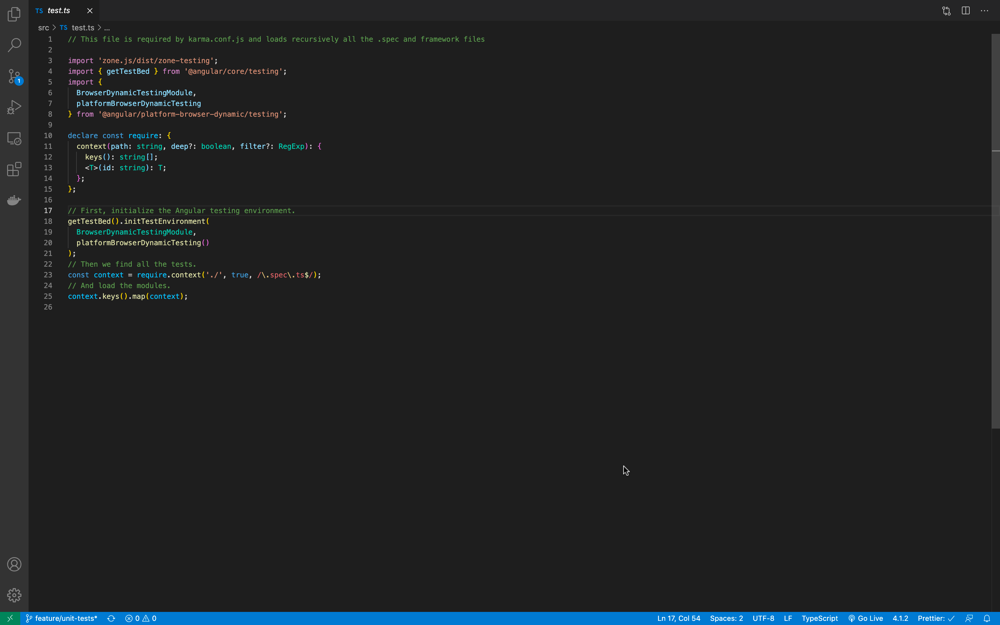
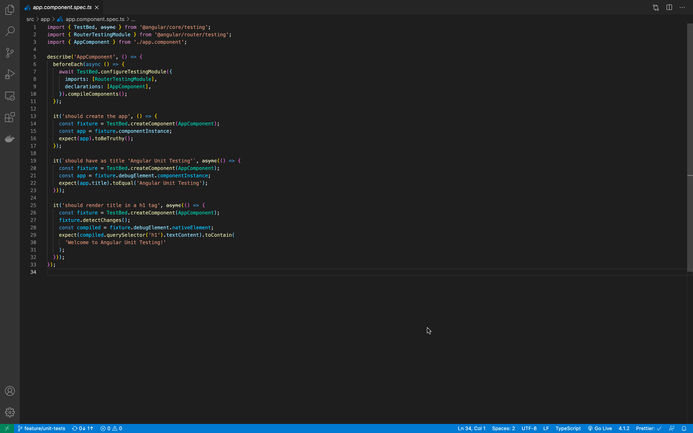

# Angular: Unit Testing

Working with unit testing on any project that at least tries to be serious is a must. You are going to have a lot of benefits by using it.

## Benefits of Unit Testing

- ### Improves the design of implementations.

Start coding a feature without giving it a lot of thought to the design is a very common mistake among developers. Using unit testing is going to enforce you to think and re-think the design, and if you are using TDD the impact is even bigger.

- ### Allows easy refactoring.

Since you already have tests that ensure that everything is working as expected, you can easily add changes to that code with the certainty that you are not adding any bugs.

- ### Allows for easy addition of new features without breaking things!

When you are adding a new feature you can run the tests to ensure that you ain’t breaking any other part of the application.

- ### Tests are good documentation.

Unit tests are a kind of living documentation of the product. To learn what functionality is provided by one module or another, developers can refer to unit tests to get a basic picture of the logic of the module and the system as a whole.

- ### Tests make you more confident about your work

- ### Any bugs are found easily and quicker

Code covered with tests is more reliable than the code without. If a future change breaks something in the code, developers will be able to identify the root of the problem right away rather than coming through the whole system to find the issue

**_Saying these benefits come at the cost of TIME is not true. You'll find that time spent creating unit tests is relatively small compared to time spent resolving bugs later (when you are introducing new features or making any refactors.) without tests._**

# [Jasmine ](https://jasmine.github.io/)

Jasmine is a behavior-driven development framework for testing JavaScript code. It does not depend on any other JavaScript frameworks. It does not require a DOM. And it has a clean, obvious syntax so that you can easily write tests.

It attempts to describe tests in a human readable format so that non-technical people can understand what is being tested.

It's the framework we are going to use to create our tests. It has a bunch of functionalities to allow us the write different kinds of tests.

# [Karma](http://karma-runner.github.io/latest/index.html)

Karma is a task runner for our tests.

It is a tool which lets us spawn browsers and run Jasmine tests inside of them all from the command line. The results of the tests are also displayed on the command line.

Karma can also watch your development files for changes and re-run the tests automatically.

Karma lets us run Jasmine tests as part of a development tool chain which requires tests to be runnable and results inspectable via the command line.

### When you create an Angular Project using the Angular CLI all the dependencies get installed among them everything you are going to need to create the tests.

`npm install -g @angular/cli`

`ng new ng-unit-testing`

## Karma Configuration File

- Frameworks - This is where we set Jasmine as our testing framework.

- Reporters - Where you set the reporters.

- autoWatch - set to true, the tests run in watch mode. This means, if you change any test and save the file the tests are re-build and re-run

- Browsers - this is where you set the browser where the test should run. By default it is chrome.

## Test Entry File

The angular-cli configuration of karma uses the file “test.ts” as the entry point of the tests for the application.

What's happening:

- An environment to run angular tests is being created using all the imports at the beginning of the file.

- TestBed is a powerful unit testing tool provided by angular, and it is initialized in this file.

- Karma loads all the test files of the application matching their names against a regular expression. All files inside our app folder that has “spec.ts” on its name are considered a test.

## AppComponent Tests

- Import all the angular testing tools that we are going to use.
- Import all the dependencies that this component has.
- Use a **describe** to start our test block
- Use an **async before each**. The purpose of the async is to let all the possible asynchronous code to finish before continuing.

Before running any test in angular you need to configure an angular testbed.

It allows you to create an angular environment for the component being tested. Any module, component or service that your tested component needs have to be included in the testbed.

After setting the configuration, we call the compile components function.

- ### In the first test, we are checking that the component contains the expected text in the "title" property.

First, we create an instance of the app.component, using the create component function of the angular testbed.

This gives us a fixture object that is going to allows us to create an instance of that component.

Now that we have an instance of app.component we can check the value in the text property an make jasmine expect to be equal to the expected value.

- ### The second test checks that the DOM renders the "text" property.

It gets the app.component fixture, executes the detect changes function which applies component changes to the HTML, applying interpolation.

Then it gets the native element of the compiled HTML - HTML rendered by the component.

Finally, we select the `h1` containing the `text` value and expect that the selected HTML contains the expected value.

## Create Grant Form - Tests

- Import angular testing tools and introduce “By” which allows us to select elements from the DOM.
- Declare the tests block using describe
- Set all the needed dependencies to start the test module.
- We'll use the promise that the “compileComponents” function returns. When the promise is resolved we give a value to each of the variables that we declare at the beginning.
- First test expects the component to be initialized.
- Second test expects the component instance has the expected value of the “text” property.
- Third test expects the property of the component “submitted” to be true when the “onSubmit” function is called.
- The fourth and fifth tests check form validity. When invalid values are added we expect the form valid property to be false and vice versa.
- The last test applies the component state to the HTML with the function “detectChanges” of the “fixture” object then it gets the submit button from the DOM and trigger the click event.

  Before all of this, we create a jasmine “spy” on the “onSubmit” function of the component.

  Finally, we expect that the spied function is not executed, because the button should be disabled since the form is not valid.

## Author

[Joel Machango](https://joelmachango.com/)

## License

MIT

## Acknowledgement & References

[Santiago García da Rosa](https://medium.com/swlh/angular-unit-testing-jasmine-karma-step-by-step-e3376d110ab4)

[Lars Bilde](https://www.youtube.com/playlist?list=PL8jcXf-CLpxolmjV5_taFP0c5LyCveDF1)

[Angular.io](https://angular.io/guide/testing)

[Fireship.io](https://fireship.io/lessons/angular-testing-guide-including-firebase)
